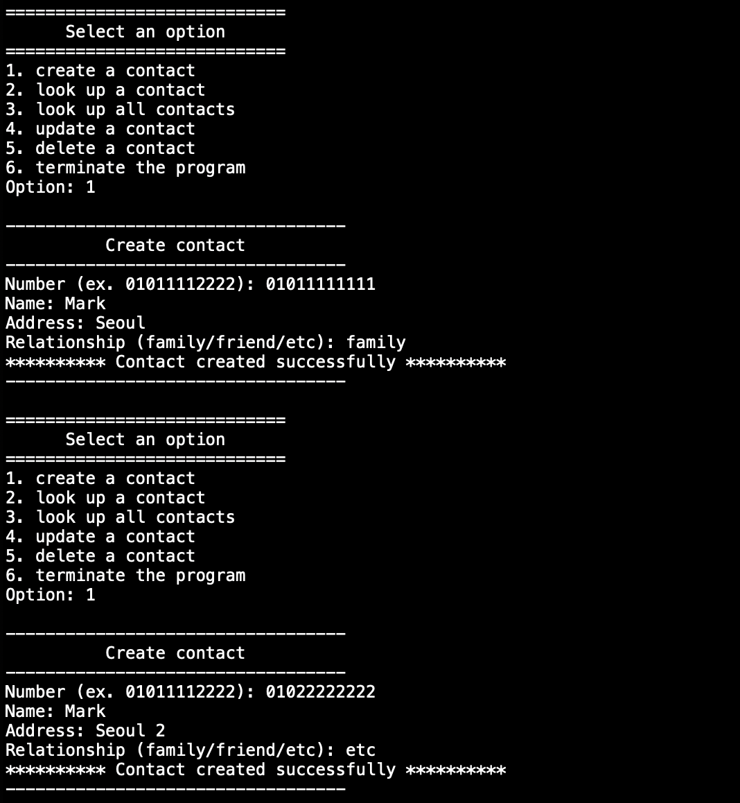
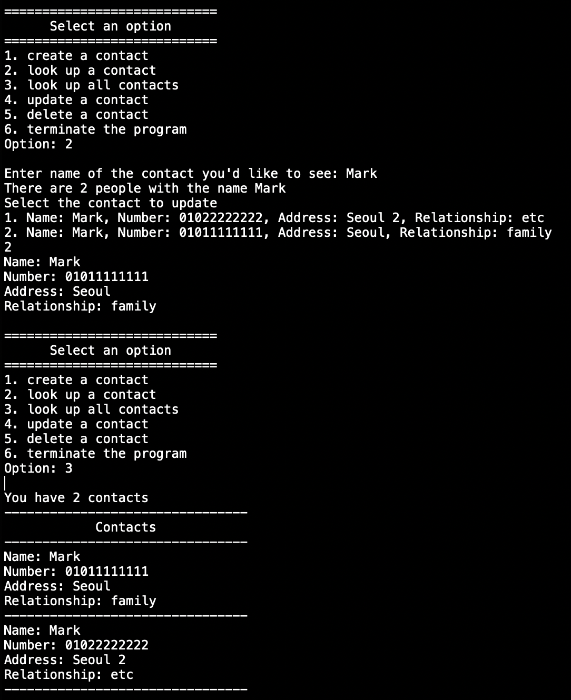
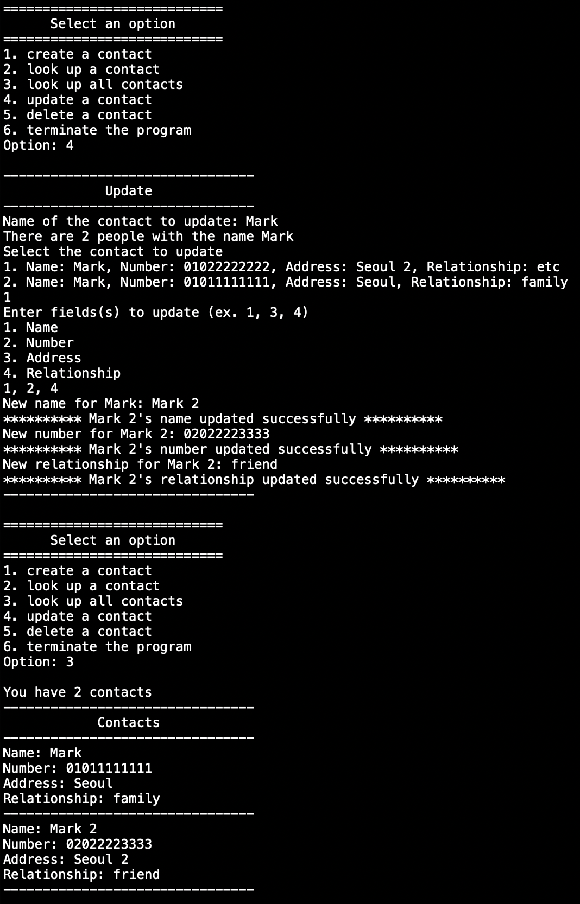
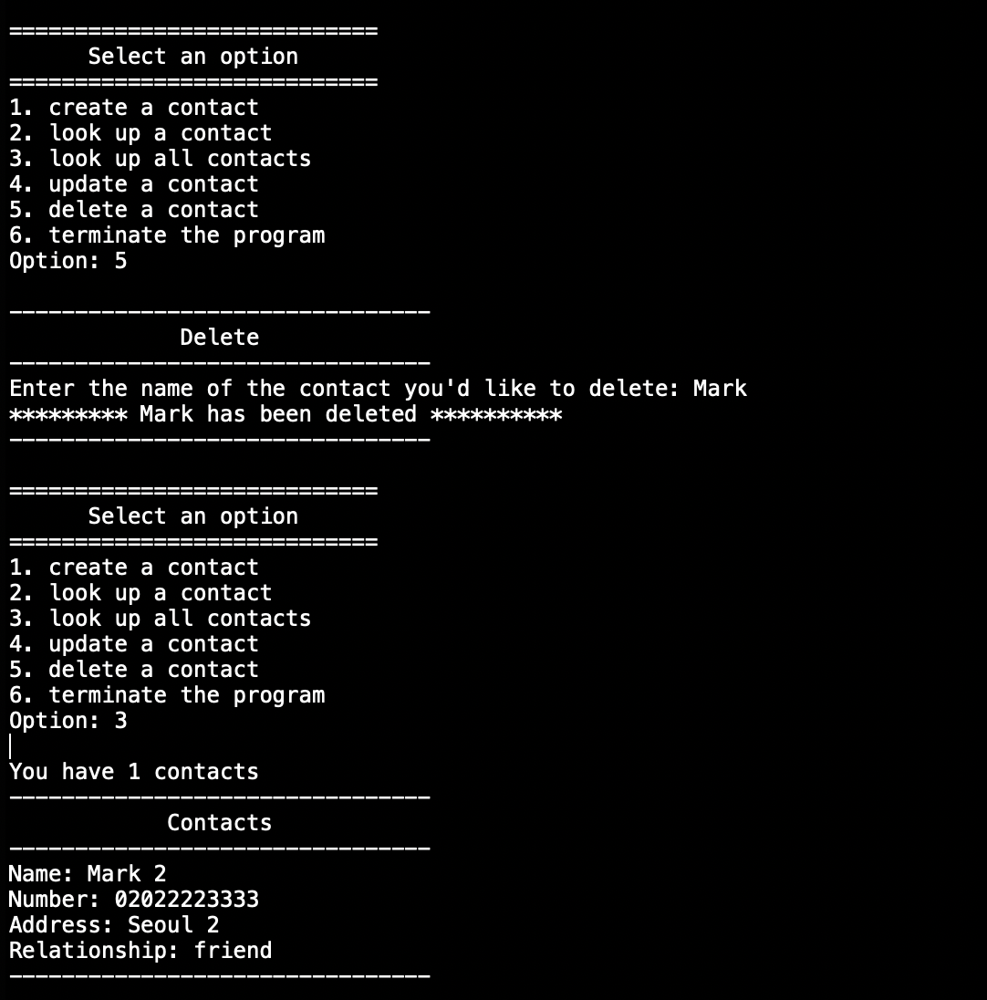
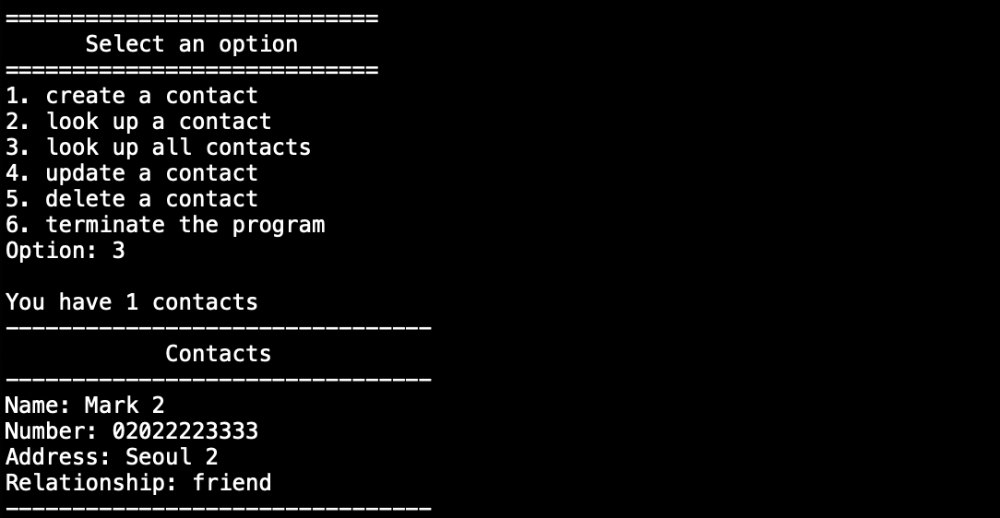

# BigData19-ContactsProject
A java program that creates/reads/updates/deletes contacts. Created contacts are saved as a binary file for local persistence.
## Pictures
### Create a contact

### Read a contact

### Update a contact

### Delete a contact

### Persistence (trust me bro)
